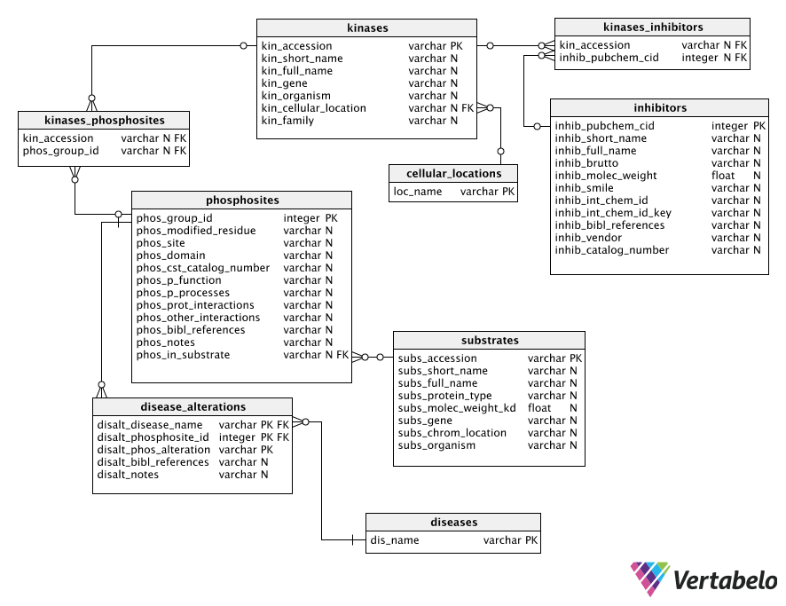

# The database
## Tools
The DB was setup in SQLite (version 3). SqLite is suitable to low- to 
medium-traffic websites and the one file approach of this type of DBs makes them 
reliable and portable. Its limitations in terms of user management and 
performance optimisation are unlikely to be felt in this project.

Python library SQLalchemy was employed to create and populate the DB. This makes
the PhosphoQuest DB and WebApp more portable and allows for performance 
improvements in the python-SQLite interactions. With SQLalchemy, the DB can be 
transferred to other DB systems, with minimal changes to the 
`sqlalchemy_declarative` (table changes), `db_sessions` (DB path and connections) 
and `db_setup` (creation of tables and data import) scripts, all in the 
`data_import_scripts` directory.

The python library `pandas` was used to parse datasets and facilitate data import. 
This library allows for the easy handling of large amounts of data in a time- 
and resource-efficient manner. 

The Python modules' versions employed in this project are specified in the project's
`README.md` file. They can easily be installed using `pip install -r requirements.txt` 
files.

## Database structure
The PhosphoQuest database contains nine tables, two of which join tables, as 
outlined in the schema below:

The term 'substrate(s)' is used to refer to a protein that is a putative kinase 
target. 'Phosphosites' are peptides within the substrate where phosphorylation 
occurs, hence a substrate may have many phosphosites, which may be targetted by 
different kinases.
The schema is defined through a SQLalchemy declarative script, 
`../PhosphoQuest_app/data_access/sqlalchemy_declarative.py`.  Some fields were 
indexed to speed up DB queries:

* `substrates` table 
    * `subs_gene`
* `phosphosites` table
    * `phos_modified_residue`
    * `phos_in_substrate`
* `kinases` table
    * `kin_cellular_location`
 
## Data Sources
### Database exports
All external datasets downloaded as files were saved in the `db_source_tables`
directory, under the relevant sub-directory.
Data on kinases, substrates, phosphosites, phosphosite regulation and 
disease-associated alterations was obtained from 
[PhosphoSitePlus](https://www.phosphosite.org). Files 
`Disease-associated_sites.gz`, `Kinase_Substrate_Dataset.gz`, 
`Phosphorylation_site_dataset.gz`, and `Regulatory_sites.gz` were used to populate 
database tables `kinases`, `substrates`, `phosphosites`, `disease_alterations`, 
and `diseases`. The files were downloaded from the `Downloads` tab, 
`Datasets from PSP` page on _**X/X/XX**_ (source last updated 04/03/2019).  
Inhibitor data was obtained from 
[MRC Kinase Profiling Inhibitor Database](http://www.kinase-screen.mrc.ac.uk/kinase-inhibitors)
as a `.csv` file on 23/03/2019 and from 
[BindingDB](https://www.bindingdb.org/bind/chemsearch/marvin/SDFdownload.jsp?all_download=yes) 
as a `zip` compressed `.tsv` file on 23/03/2019 (source last updated 01/03/2019) 
(`Ligand-Target-Affinity Datasets` > `Only data curated from articles by BindingDB`,
`BindingDB_BindingDB_Inhibition_2019m2.tsv.zip ` file). Given BindingDB's file
size, it could not be added in its uncompressed form to the github repo due to
the latter's file size restrictions.

### Application Programming Interface (API) Documentation
API functionality was dependent on the pandas module to allow handling of data 
structures. The API scripts were also dependent on the urllib module to allow 
utilization of URLs. For our database, we required access to UniProt and PubChem 
websites with the ability to search multiple accession numbers and output as a 
dataframe for population of the SQLite database. 

To enable population of the database, we utilised APIs from three different 
websites:

####	UniProt

The UniProt website obtains specific data using a kinase or substrate qualifier 
from the default UniProt site: 

https://www.uniprot.org/uploadlists/

The API uses a number of parameters which are selected when performing a search:

- The ability to convert to another identifier type from your original input type 
is an option. The default here is the ACC abbreviation which is the UniProtKB AC 
category. 
- The return format is in tab form.
- The columns denote the categories of information which can be retrieved. The 
UniProtKB column names for programmatic access can be found 
[here](https://www.uniprot.org/help/uniprotkb_column_names).

To allow population of the database, we have selected as a default the following 
qualifiers:
```
'columns': 'id,protein names,comment(SUBCELLULAR LOCATION),families,genes'
```
- The final qualifier is the accession number itself.

In terms of functionality, the code:

i) Takes parameters and encodes them in a URL format.

ii) Changes to utf-8 format.

iii) Requests the URL and paramters (stored as data) using urllib.request.

iv) Opens the respective URL with parameters and stores as a response variable.

v) Places the retrieved data into a dataframe.

Based on the information retrieved, one of parameters we require to populate our 
database is the subcellular location. This qualifier returns multiple pieces of 
information relating to the subcellular location and here we only wish to retrieve 
the first set of information, the subcellular location. We create a separate 
column and using regular expression extract this information. This is also 
repeated for gene names where we only take the first instance. 

####	PubChem 

To access data from the PubChem website, we have utilised the PubChem REST-style 
version of PUG (Power User Gateway) utility which is a web interface for accessing 
PubChem data and services. To access the data, a URL with a specific structure is 
required: 

- The URL has three parts – input, operation, and output: 

https://pubchem.ncbi.nlm.nih.gov/rest/pug/*input specification*/*operation specification*/*output specification*/*operation_options*

In our case, the selected data was obtained using the CID qualifier from the 
[PubChem site](https://pubchem.ncbi.nlm.nih.gov/rest/pug/compound/).

This API allows a number of qualifiers to be retrieved. The full lit can be 
accessed from the following website: https://pubchemdocs.ncbi.nlm.nih.gov/pug-rest

To allow population of the database, we have selected the columns:

i) IUPACName

ii) MolecularFormula

iii) MolecularWeight

For our searches, the following example was utilized:  

```
results_csv = ("https://pubchem.ncbi.nlm.nih.gov/rest/pug/compound/"
               "cid/" + query_str + "/property/"
               "IUPACName,MolecularFormula,MolecularWeight/csv")
```       

Where 'query_str' denotes the CID qualifiers. The data was then converted from
csv to a dataframe ready for population of the SQLite database.
        
## Database setup
To recreate the database from newly imported data, run the `db_setup.py` script
which will first create the database schema if not in place already, then import
the PhosphoSitePlus, MRC and BindingDB datasets, and finally obtain additional
data from UniProt and PubChem using the `api_import.py` script. The script will
also curate individual records found to be incorrect.
The interaction between the various scripts are shown in the diagram below:

The process is outlined below:

1. Data downloaded from data sources as described in the 'Database exports'
section above;
2. Downloaded files parsed into data frames through `table_parsing.py` import
scripts, using auxiliary functions in `df_editing.py`;
3. Data frames imported into the DB through the `sqlalchemy_import.py` script
with the auxiliary `class_functions.py` and an import session from `db_sessions.py` 
script in the `data_access` directory and following the mapping of data frame 
column headings to SQLalchemy class objects and their attributes input into
`df_to_attributes.py`. Only BindingDB data for the inhibitors associated with
kinases already imported is imported in order to select out drugs unrelated 
to phosphorylation inhibition;
4. Specific incorrect records are curated;
5. Missing data imported for the existing records from Uniprot and PubChem APIs
using the `api_imports.py` script.

### Importing additional data
Additional data can be easily imported to the databse by parsing a data table 
input into a pandas data frame and then matching the data frame column headings 
to the fields they are destined for in the database in the `df_to_attributes.py`. 
Only data for empty record fields is imported (existing data will not be 
over-written). To replace existing data, remove the field in question from
`df_to_attributes.py` dictionary for the undesired data source and run `db_setup.py` 
again.