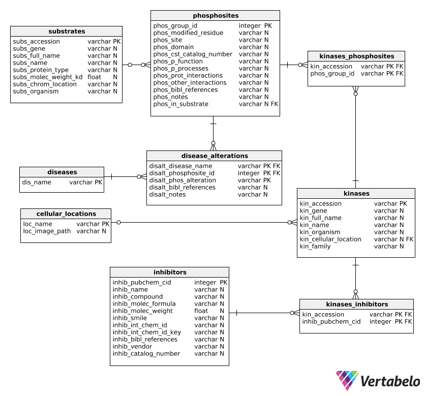
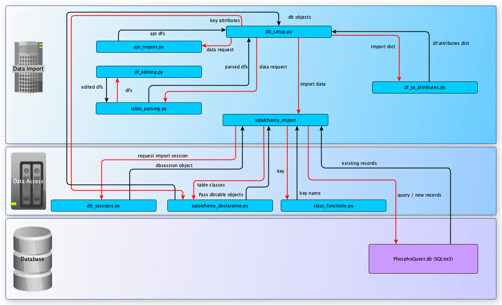

# The database
## Tools
The database (DB) was setup in SQLite (version 3). SQLite is suitable to low- to medium-traffic websites and the one file approach of this type of DBs makes them reliable and portable. Its limitations in terms of user management and performance optimisation are unlikely to be felt in this project.

The python library SQLalchemy was employed to create and populate the DB. This makes the PhosphoQuest DB and WebApp more portable and allows for performance improvements in the python-SQLite interactions. With SQLalchemy, the DB can be transferred to other DB systems, with minimal changes to the `sqlalchemy_declarative.py` (table definitions; `PhosphoQuest_app/data_access` directory) and `db_sessions.py` (DB path and connections; `data_import_scripts` directory) scripts.

The python library `pandas` was used to parse datasets and facilitate data import. This library allows for the easy handling of large amounts of data in a time- and resource-efficient manner. 

The Python libraries' versions employed in this project are specified in the project's [README file](../README.md#python-package-requirements). They can easily be installed using `pip install -r requirements.txt`.

## Database structure
The PhosphoQuest database contains nine tables, two of which join tables, as outlined in the schema below:



The term 'substrate' is used to refer to a protein that is a putative kinase target. 'Phosphosites' are peptides within the substrate where phosphorylation occurs, hence a substrate may have many phosphosites, which may be targetted by different kinases.
The schema is defined through a [SQLalchemy declarative script](../PhosphoQuest_app/data_access/sqlalchemy_declarative.py).  Some fields were indexed to speed up DB queries:

       Table       |         Field
------------------ | ---------------------
substrates      | subs_gene
phosphosites | phos_modified_residue
phosphosites | phos_in_substrate
kinases          | kin_cellular_location

 
## Data Sources
### Database Exports
All external datasets downloaded as files were saved in the `db_source_tables` directory, under the relevant sub-directory.
Data on kinases, substrates, phosphosites, phosphosite regulation and 
disease-associated alterations was obtained from [PhosphoSitePlus](https://www.phosphosite.org). Files `Disease-associated_sites.gz`, `Kinase_Substrate_Dataset.gz`, `Phosphorylation_site_dataset.gz`, and `Regulatory_sites.gz` were used to populate database tables `kinases`, `substrates`, `phosphosites`, `disease_alterations`, and `diseases`. The files were downloaded from the `Downloads` tab, `Datasets from PSP` page on 23/03/2019 (source last updated 04/03/2019).  
Inhibitor data was obtained from [MRC Kinase Profiling Inhibitor Database](http://www.kinase-screen.mrc.ac.uk/kinase-inhibitors) as a `.csv` file on 23/03/2019 and from [BindingDB](https://www.bindingdb.org/bind/chemsearch/marvin/SDFdownload.jsp?all_download=yes) as a `zip` compressed `.tsv` file on 23/03/2019 (source last updated 01/03/2019) (`Ligand-Target-Affinity Datasets` > `Only data curated from articles by BindingDB`, `BindingDB_BindingDB_Inhibition_2019m2.tsv.zip ` file). Given BindingDB's file size, it could not be added in its uncompressed form to the github repo due to
the latter's file size restrictions.

### Application Programming Interface (API)
API functionality was dependent on the pandas module to allow handling of large datasets. The python urllib library was used for opening, reading and parsing of URLs. For our DB, we used data from UniProt and PubChem websites, which allow for searching with multiple accession numbers and output data in a dataframe-compatible format for population of the DB. 

To complete population of the DB, we utilised the following two website APIs:

####	UniProt

The [UniProt](https://www.uniprot.org/uploadlists/) website API allows for the collection of specified data using a kinase or substrate accession number.

For this
- parameters are selected when performing a search 
- categories of information to be retrieved are indicated as columns
- UniProtKB column names for programmatic access can be found [here](https://www.uniprot.org/help/uniprotkb_column_names)
- results are returned in tab format.

To allow population of the database, we have selected the following qualifiers:
```
'columns': 'id,protein names,comment(SUBCELLULAR LOCATION),families,genes'
```
ID contains the accession number of the records to be retrieved.

In terms of functionality the code:

1. Takes parameters and encodes them in a URL format;
2. Changes to utf-8 format;
3. Requests the URL with DB record accession numbers as parameters using urllib.request;
4. Opens the respective URL and stores the data for the requested columns as a response variable;
5. Places the retrieved data into a dataframe.

Based on the information retrieved, one of parameters we require to populate our database is the subcellular location. This qualifier returns multiple pieces of information relating to the subcellular location and here we only wish to retrieve the first set of information, the subcellular location. We create a separate column and using regular expression extract this information. This is also repeated for gene names where we only take the first name in the returned value. 

####	PubChem 

To access data from the PubChem website, we have utilised the PubChem REST-style version of PUG (Power User Gateway) utility which is a web interface for accessing PubChem data and services. To access the data, a URL with a specific structure is required: 

The URL has three parts – input, operation, and output: 

```
https://pubchem.ncbi.nlm.nih.gov/rest/pug/*input specification*/*operation specification*/*output specification*/*operation_options*
```
In our case, the selected data was obtained using the CID qualifier from the [PubChem site](https://pubchem.ncbi.nlm.nih.gov/rest/pug/compound/).

This API allows a number of qualifiers to be retrieved. The full list can be accessed from the [PubChem PUG-REST website](https://pubchemdocs.ncbi.nlm.nih.gov/pug-rest).

To populate the DB, we have selected the columns:

1. IUPACName;
2. MolecularFormula;
3. MolecularWeight.

The following request was utilized to populate the `inhibitors` table:  

```
results_csv = ("https://pubchem.ncbi.nlm.nih.gov/rest/pug/compound/"
               "cid/" + query_str + "/property/"
               "IUPACName,MolecularFormula,MolecularWeight/csv")
```       

Where 'query_str' denotes the PubChem CID compund identifiers. The data was then converted from
csv to a dataframe ready for population of the database.
        
## Database setup
To recreate the database from newly imported data, run the `db_setup.py` script which will first create the database schema if not in place already, then import the PhosphoSitePlus, MRC and BindingDB datasets, and finally obtain additional data from UniProt and PubChem using the `api_import.py` script. The script will also curate individual records found to be incorrect.
The interactions between the various scripts are shown in the following diagram:



The process is outlined below:

1. Data downloaded from data sources as described in the [Database Exports](#Database-Exports) section above;
2. Downloaded files parsed into dataframes through `table_parsing.py`, using auxiliary functions in `df_editing.py`;
3. Dataframes imported into the DB through the `sqlalchemy_import.py` script (in `data_import_scripts` directory) with auxiliary functions in `class_functions.py` and an import session from `db_sessions.py` script (both in the `data_access` directory), following the mapping of dataframe column headings to SQLalchemy class objects and their attributes set out in `data_import_scripts/df_to_attributes.py`.
    * BindingDB data is filtered to include only data for inhibitors associated with kinases in the DB;
4. Specific incorrect records are curated;
5. Missing data imported for the existing records from Uniprot and PubChem APIs using the `api_imports.py` script (`data_import_scripts` directory).

### Importing additional data
Additional data can be easily imported to the database by parsing a data table input into a pandas dataframe and then matching the dataframe column headings to the fields they are destined for in the database in the `df_to_attributes.py`.  Only data for empty record fields is imported (existing data will not be over-written). To replace existing data, remove the field in question from the `df_to_attributes.py` dictionary for the undesired data source and run `db_setup.py` again.
