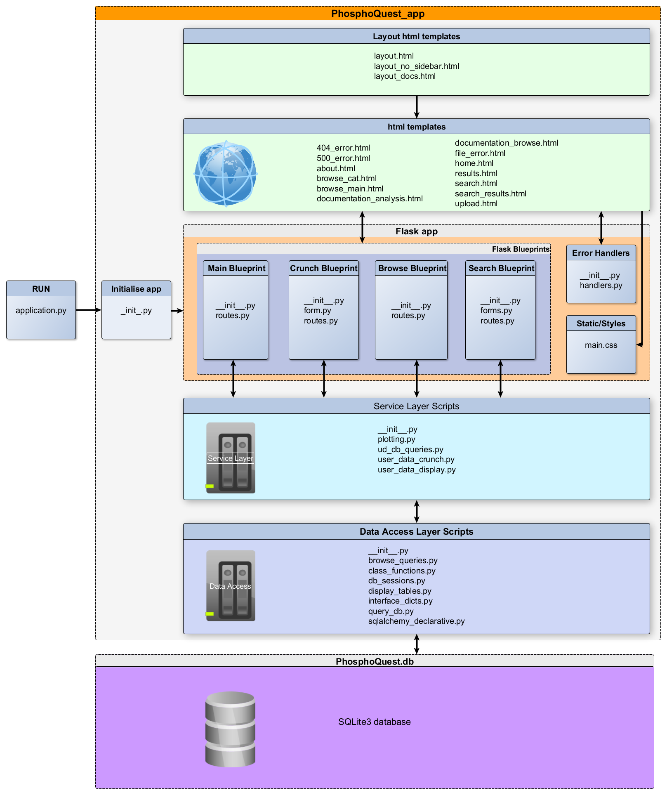

# Flask Application Structure
## Introduction
This website is built using the Flask 1.0.2. Flask is a Python web microframework
makes it relatively easy to build basic websites, but also offers extended 
features that enable development of more sophisticated sites. The documentation for the Flask python package 
library can be found at the [Flask website](http://flask.pocoo.org/).

From the outset, the project team decided that all the functional code within the 
application should be written in Python 3. Python was chosen as a 
widely used, powerful and relatively easy to read, programming language. In 
addition there are many packages available for Python and they are well supported.
 
Python version 3.6+ is necessary for functionality due to some of
the functions used within the code having changed syntax from earlier versions
of Python 3. Python 3 was used as Python 2 is being depreciated and will not be maintained past 
January 1st 2020. 

Flask uses [Jinga2](https://www.palletsprojects.com/p/jinja/) and the 
[Werkzeug WSGI toolkit](https://www.palletsprojects.com/p/werkzeug/) for web
 functionality (template rendering).

## Additional Python Packages used within the webapp
`flask-WTF` and `WTForms` were used to create web forms for the search function and 
for the user data upload function. These packages give extra functionality in terms of validating form field and providing ready-formatted web display objects (form fields and buttons) specifically for Flask applications.

`flask-table` was used to create tables of browse and search results for display. This package creates table Class objects with user-definable fields including link-columns and passes html table class items for web display. 

Webpage styles are based on `html5` with `Bootstrap CSS 4.2.1` with local tweaks in the `main.css` file, `jquery` is used for tabs on results page.

 Further information on the following packages and how they are used in this 
 application can be found in the accompanying documentation files. 
 
* `SQLAlchemy` - used to create and populate the database. 

*  `pandas`, `statsmodels` and `numpy` - used to parse datasets, facilitate data import
and for user data analysis.
* `matplotlib`, `wordcloud` and `plotly` - used to visualise analysed data

 

The Python modules' versions employed in this project are specified in the project's
`README.md` file. They can easily be installed using `pip install -r requirements.txt` 
files.

## Application structure
The PhosphoQuest application requires an SQLite3 database (`PhosphoQuest.db`) situated in the folder level outside of the `PhosphoQuest_app` folder. Also in this location, `application.py` is a script which is run to activates the Flask application `PhosphoQuest_app`. `python3 application.py` or a similar command should activate the application (when all requirements are installed).

### App Folder structure 

The structure of the software consists of a `PhosphoQuest_App` folder.This folder contains the `__init__.py` file that initiates the instance of the PhosphoQuest Flask application. 

The `PhosphoQuest_App` folder contains subfolders corresponding to *Flask Blueprints* for routes `main`, `search`, `browse`, and `crunch`. Blueprints enable developers to simplify large applications and separate the code. For information about Flask Blueprints see [link](http://flask.pocoo.org/docs/0.12/blueprints/). 

* `main` - contains `routes` for main pages on the website, *i.e.* the homepage, documentation pages and about us page.
* `search` - contains `routes` for search page and a `forms` script which initiates a form class object for display on search page
* `browse` - contains `routes` for browse pages 
* `crunch` -contains `routes` for userdata analysis pages and a `forms` script which initiates a form class object for display on the upload page
 
Additional folders within the `PhosphoQuest_App folder are:

 `static` - contains images used on the webpages and the following subfolders: 

 * Subfolder `styles`, containing the `main.css` local css file
 * Subfolder `userdata_temp` for temporary storage of user data and output files.
 
`templates` - contains all the website html template files.

`errors` - contains error handlers

`service_scripts`-  containing scripts used in user data analysis

`data_access`- containing scripts for querying the PhosphoQuest database.

### An overview diagram of the PhosphoQuest app structure is shown below.

### Script interactions

The interactions between the various scripts and the methods used in the PhosphoQuest_app is shown in the detailed documentation.

* [Browse and Search documentation](search_and_browse.md)
* [User data analysis documentation](user_data_analysis.md)
* [Result plotting documentation](plotting.md)
* [Database documentation](database.md)

### Application limitations and potential issues
* Search function is basic and does not recognise logical functions or wild-cards in the text field.
* Data analysis is all done at once on successful upload of a file, and can take a minute or more to complete depending on input file and resources available. During which time there is no user feedback, only a slight css change to `submit` button style. There is no progress spinner or any extra text.
* Errors with data file upload can display in two ways depending on the error type, some are caught by the `user_data_check` function and display as flash messages on the upload page, and others cause an error which is caught by the `try-except` method and give the `file-error.html` page, the information on the page should, however, help to explain what the problem could be. 
* Due to the large amount of data and images rendered on the user-data results page it can take a few seconds after the page initially appears for the styles to render fully (eg. for the jquery tabs to show correctly).
* Issues occasionally occur with the display of the html interactive pie-charts on the user-data results page. We do not currently know the reason for this, but re-running the analysis usually fixes the display issue

