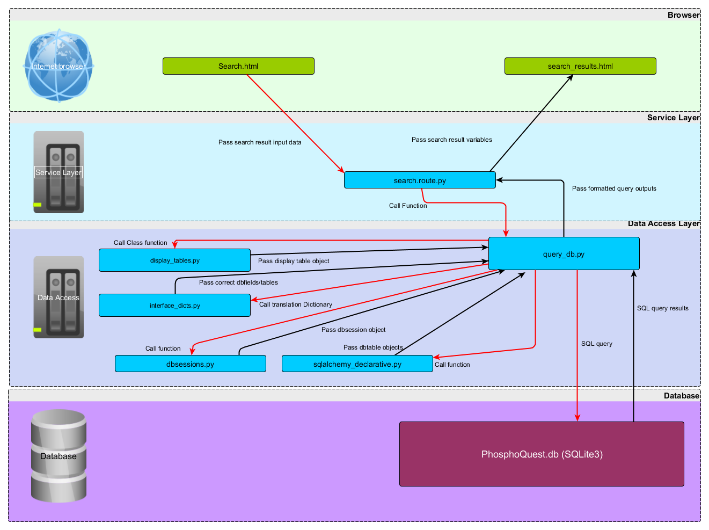
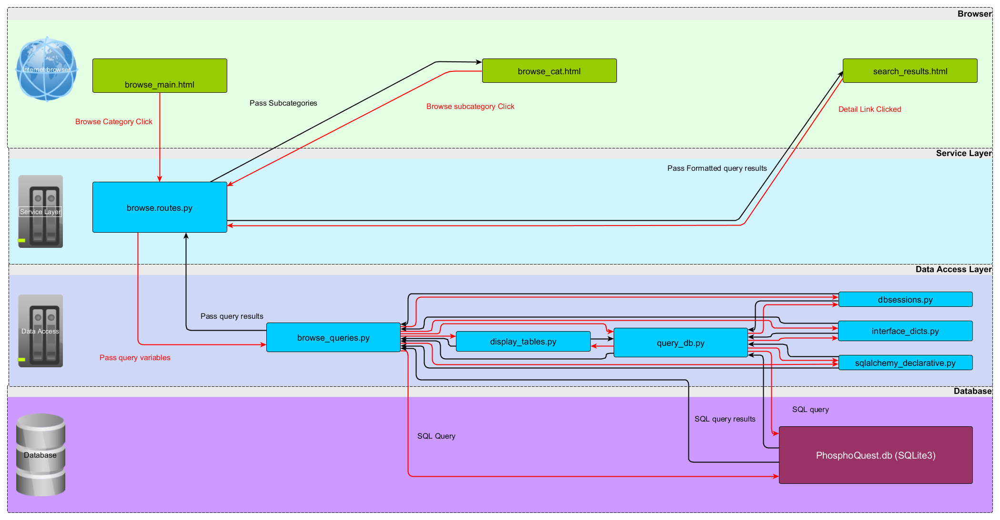

# Browse and Search Script functions

## Search script overview

An overview of how the search scripts interact in the application is shown below.

## Search script information
`routes.py` and `forms.py` within the `search` folder of the `PhosphoQuest_app` contain the Flask routes and Flask form class set up for display of the search page on the web-app.

`Forms.py` sets up the search form with options for the database table to search (currently limited to *Kinases*, *Substrates* and *Inhibitors*, which information to search (*accession/ID* and *name*) and which type of search to perform (*like* or *exact*).

`routes.py` contains the Flask route `/search` which receives the user input from the forms, calls auxillary functions from `data_access/query_db` and renders different templates depending on user input and query results. 

The `query_switch` function within `query_db.py` which is located within the `data_access` folder layer is called by the `routes.py` and handles the differing options and searches based on the user inputs from the form. The formats of the various outputs depending on the number of query results are also handled by functions within `query_db.py` before being passed back to `routes.py` for rendering on the template, `search_results.html` template.  

`search_results.html` is a generic template that is used to display many different types of search result outputs and is also used for displaying all of the browse result outputs. 

### Limitations specific to search
* Exact match search only returns results if the input text is **exactly the same as the entire field contents** of the searched database field. This may be unexpected for the user but avoids cases where for example accession number "123" is searched and accession number "123", "1234" and "12345" is returned).
* Only able to search accession/ID field or Name (field in database that is searched for "Name" depends on table for search)
* Search does not recognise wild-cards eg "*"
* Search does not understand logical and boolean inputs (e.g. search text inputs like `"DNA" AND "replication"`)

## Browse script overview
An overview of how the search scripts interact in the application is shown below.

`routes.py` within the `browse` folder of the `PhosphoQuest_app` contain the Flask routes for display of the various browse pages on the web-app.

The routes `browse_main` and `browse_cat`, render pages of browse category buttons. For some categories there is only one level of browse buttons to click (eg. inhibitors where the only browse option at present is to browse all inhibitors), for others there are several levels of buttons to click, eg *Kinases*, where they can be browsed by categories eg. *Kinase Family*, and then sub-categories eg. *Alpha-type protein kinase*.

The categories *Kinase family* and *Kinase cellular location* are called from a fixed set of entries curated from a one off search of the PhosphoQuest.db field for the respective type and contained within a dictionary, the curation was necessary to avoid very high numbers of categories. However, the subcategory *Substrate-Chromosome location* is obtained from a live database query for all chromosome locations which is then parsed using a regular expression to show only distinct chromosome number (or X/Y) and p or q arms, eg (12p) to reduce the number of categories for adding to the browse buttons.

Clicking any of the final level category or subcategory buttons triggers a "like" query run from the function `searchlike()` in `data_access/query_db`

The `routes.py` functions deal with handling the different browse categories button display pages that are presented, and calls various functions from the `browse_queries.py` script wihtin the `data access` folder in order to do so. The routes described below handle the various different output types from the browse functions.

`browse_table` renders pages for tabular display of browse query results. The tables contain a *Detail* field which then links to the individual record information for each result item. 

The various `browse_XXXdetail` routes all perform queries and render pages for detail view of an individual item with tables of related information (eg. One kinase record with corresponding tables of related phosphosites and inhibitors). 

All results from the browse queries are displayed using the generic `search_results.html` template which can handle multiple different types of outputs. 

### Limitations specific to browse
* No sub-categories have currently be applied for Inhibitors, can only browse all.
* Only one subcategory applied for Substrates.
* Chromosome location categories appear in semi-numerical order (ie. 10 appears before 1) due to the alphanumeric nature of the text
* Passing of browse categories to functions is currently done by string split methods which could potentially result in errors if the character used to split is found within the database, this has not happened in testing, however the method for passing the information would be better changed to url arguments in a future update. 

## Limitations for both browse and search features
* Unable to search or browse phosphosites table directly (but related results are obtained from searches on substrate or kinase)
* Although further information is contained within the database (such as disease aliteration) it is not currently possible to view this data in any search or browse result page (for future development)
* Output tables can be very large and are not currently sortable by field header (future development), data can be found within the page using the browser `find` function.
