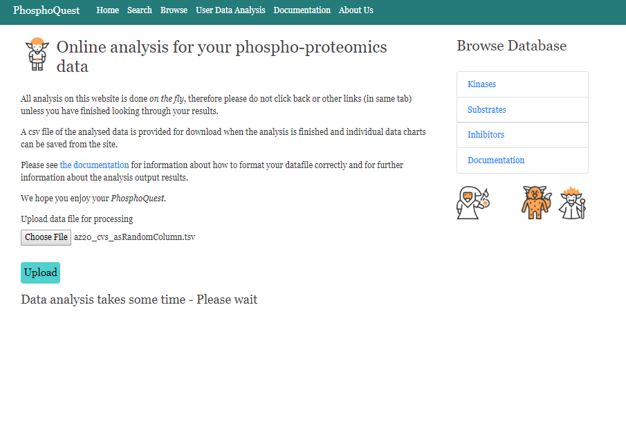

# User Input Testing 

This document displays a number of example searches that constitute user input data in different formats. 

i) [User input AZ20.tsv](user_input_testing.md#test-case-scenario-1--user-input-az20tsv)

ii) [User input AZ20.tsv, however missing the CV column](user_input_testing.md#test-case-scenario-2--user-input-az20tsv-however-missing-the-cv-column)

iii) [User input AZ20.tsv, however CV column is in a random location](user_input_testing.md#test-case-scenario-3--user-input-az20tsv-however-the-cv-column-is-in-a-random-location)

iv) [User input AZ20.tsv, however the residue type and number does not contain any 'nones'](user_input_testing.md#test-case-scenario-4--user-input-az20tsv-however-the-residue-type-and-number-does-not-contain-any-nones)

v) [User input AZ20.tsv, however the substrate name column has been placed as the final column](user_input_testing.md#test-case-scenario-5--user-input-az20tsv-however-the-substrate-name-column-has-been-placed-as-the-final-column)

vi) [User input AZ20.tsv, however the substrate name column has been placed in a random position](user_input_testing.md#test-case-scenario-6--user-input-az20tsv-however-the-substrate-name-column-has-been-placed-in-a-random-position)

vii) [User input AZ20.tsv, however the p values column is missing](user_input_testing.md#test-case-scenario-7--user-input-az20tsv-however-the-p-values-column-is-missing)

viii) [User input AZ20.tsv, however the p values column is in a random column](user_input_testing.md#test-case-scenario-8--user-input-az20tsv-however-the-p-values-column-is-in-a-random-column)

ix) [User input AZ20.tsv, however the fold values column is missing](user_input_testing.md#test-case-scenario-9--user-input-az20tsv-however-the-fold-values-column-is-missing)

x) [User input AZ20.tsv, however the fold values column has been moved to a different column](user_input_testing.md#test-case-scenario-10--user-input-az20tsv-however-the-fold-values-column-has-been-moved-to-a-different-column)

### Test case scenario 1 = User input AZ20.tsv 

Results for AZ20.tsv are as follows with no error messages displayed.  

 
  
### Test case scenario 2 = User input AZ20.tsv, however missing the CV column 

  
 
Results for AZ20.tsv without the CV column. Here, the data analysis is still performed, however if the original file does not include a CV column, then only the p-value threshold is applied towards the calculation.   

  
### Test case scenario 3 = User input AZ20.tsv, however the CV column is in a random location 

  
  
Results for AZ20.tsv with the CV columns in a different location. Here, the data analysis does not perform, as it expects the CV columns to be at the end fo the user data file. 

 
   
### Test case scenario 4 = User input AZ20.tsv, however the residue type and number does not contain any 'nones'

 
  
Results for AZ20.tsv_noNones show that the analysis functions as normal and the lack of 'nones' within the substrate column does not affect the analysis.
 

  
### Test case scenario 5 = User input AZ20.tsv, however the substrate name column has been placed as the final column

 

Results for AZ20.tsv_substrateColumn_asFinalColumn show that the current analysis requires the substrate name information to be as the first column of the user input file. 

  
### Test case scenario 6 = User input AZ20.tsv, however the substrate name column has been placed in a random position

 

Results for AZ20.tsv_substrateColumn_asRandomColumn show that the current analysis requires the substrate name information to be as the first column of the user input file. 

  
### Test case scenario 7 = User input AZ20.tsv, however the p values column is missing

 

Results for AZ20.tsv_missingP values show that the current analysis requires a P value column to be present for the analysis to be completed.  

  
### Test case scenario 8 = User input AZ20.tsv, however the p values column is in a random column

 

Results for AZ20.tsv_missingPvalues show that the current analysis requires a P value column to be present for the analysis to be completed.  

  
### Test case scenario 9 = User input AZ20.tsv, however the fold values column is missing

 

Results for AZ20.tsv_missingFoldvalues show that the current analysis requires a Fold value column to be present for the analysis to be completed.  

  
 ### Test case scenario 10 = User input AZ20.tsv, however the fold values column has been moved to a different column

 

Results for AZ20.tsv_FoldValues_asRandomColumn show that the current analysis requires a Fold value column to be present in the expected column.  

**Summary** 

In this short user app testing, we have tested a number of different scenarios in relation to different user input files:- 

- User input AZ20.tsv 
- User input AZ20.tsv, however missing the CV column 
- User input AZ20.tsv, however the CV column is in a random location 
- User input AZ20.tsv, however the residue type and number does not contain any 'nones'
- User input AZ20.tsv, however the substrate name column has been placed as the final column
- User input AZ20.tsv, however the substrate name column has been placed in a random position
- User input AZ20.tsv, however the p values column is missing
- User input AZ20.tsv, however the p values column is in a random column
- Test case scenario 9 = User input AZ20.tsv, however the fold values column is missing
- Test case scenario 10 = User input AZ20.tsv, however the fold values column has been moved to a different column

We have tried to graphically illustrate the results of such searches and show that in each of the different scenarios, the website does not crash, but the errors are captured in different ways. These error messages denote that there is something wrong with the input file in terms of order or columns of required information are missing. The user input testing also shows how missing CV columns can be accounted and the analysis completes without taking CVs into consideration. 

